# REPORT — Hôte NAM A2 WAM : utilisateurs, connexions et presets

> Mini-projet TP4 — Technos Web, M1 MIAGE 2026-2027.
> Fork : https://github.com/xDraawwScript/NAM_A2_WAM — projet d'origine : https://github.com/micbuffa/NAM_A2_WAM
> Journal détaillé, étape par étape : [`SUIVI.md`](SUIVI.md) · Sécurité : [`SECURITE.md`](SECURITE.md) ·
> API : [`server/API_CONTRACT.md`](server/API_CONTRACT.md)

## 1. Objectif

Le projet d'origine est un hôte Web Audio Modules (WAM) pour guitare : un ampli à réseau de neurones
(NAM), une simulation de haut-parleur (Cabinet, par réponse impulsionnelle) et une trentaine de pédales
d'effets. La consigne était de **faire une version améliorée de l'hôte pour gérer utilisateurs,
connexions et presets (load/save)**, **sans toucher au code des plugins** : l'état de chaque plugin
est capturé et restauré uniquement par ses méthodes WAM `getState()` / `setState()`.

Aucun fichier de `src/` (plugins NAM, Cabinet, WASM) ni de `examples/wam/wamPlugins/` n'a été modifié.

## 2. Fonctionnalités

| Fonctionnalité | Détail |
|---|---|
| **Presets d'usine** | 7 sons prêts à jouer (Clean Deluxe, Ambient Clean, Crunch JCM800, Lead Soldano, High Gain 5150, Fuzz Muff, Bass SVT), en lecture seule, volumes égalisés |
| **Presets dans le navigateur** (mode invité) | Enregistrer le son actuel (nom + tags), charger, renommer, mettre à jour, supprimer ; stockage IndexedDB |
| **Indicateur « modifié »** | Le nom du preset courant s'affiche dans l'en-tête, suivi de `•` dès que le son change |
| **Export / import** | Fichier `.json` autonome (modèles/IR externes inclus, hash vérifiés à l'import) |
| **Comptes** | Inscription (pseudo public unique, email privé, mot de passe), connexion, profil, changement de pseudo, déconnexion ; session conservée au rechargement |
| **Presets en ligne** | Enregistrés sur le compte, **privés ou publics**, disponibles sur tous les appareils ; copie des presets du navigateur vers le compte |
| **Explorer** | Presets publics de tous les utilisateurs, **même sans compte** : récents d'abord, recherche (nom, tag, ampli, pédale, auteur), aperçu de la chaîne, chargement, copie dans ses presets |
| **Interface FR / EN** (mission 8) | Thème « Tolex & Lampes », français et anglais retraduits en direct, guide de démarrage, notifications, aide des raccourcis, fond animé optionnel, accessible au clavier (détails en 3.1) |
| **Modèles et IR partagés** | Un modèle d'ampli ou une IR n'est stocké qu'**une fois**, identifié par son empreinte SHA-256 ; un preset pèse ~14 Ko au lieu de ~850 Ko |

Un preset contient **tout le rack** : chaînes A et B, ordre des pédales et leurs réglages, ampli,
cabinet, gains, panoramique, routage A→B. Il ne contient **ni** le gain d'entrée (propre à la guitare
et à la carte son), **ni** la backing track, **ni** aucun jeton ou identifiant d'appareil, et le
charger n'active jamais le micro (spec du projet d'origine, §7.2).

## 3. Interface utilisateur

Deux boutons ont été ajoutés dans l'en-tête du rack : **Compte** (« Se connecter » ou le pseudo) et
**Presets** (avec le nom du preset courant). Depuis la mission 8, toute l'interface de l'hôte existe
**en français et en anglais** (voir la section 3.1). Les captures ci-dessous, prises avant la refonte
(mission 8), montrent les fenêtres en anglais avec l'ancien habillage ; leurs fonctions n'ont pas changé.

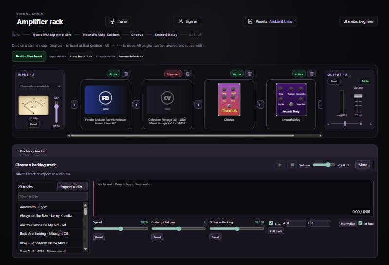

*Le rack après chargement du preset d'usine « Ambient Clean » : ampli Fender, cabinet, chorus et delay.*

| Onglet Factory | Onglet My account |
|---|---|
| 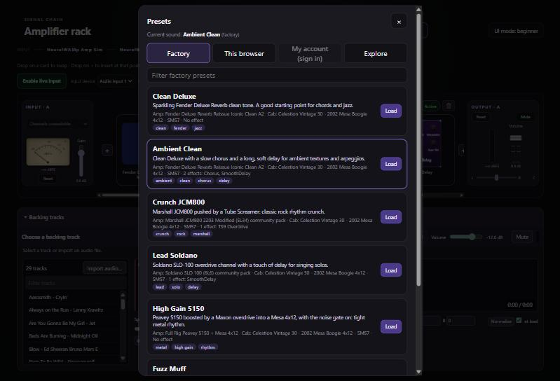 | 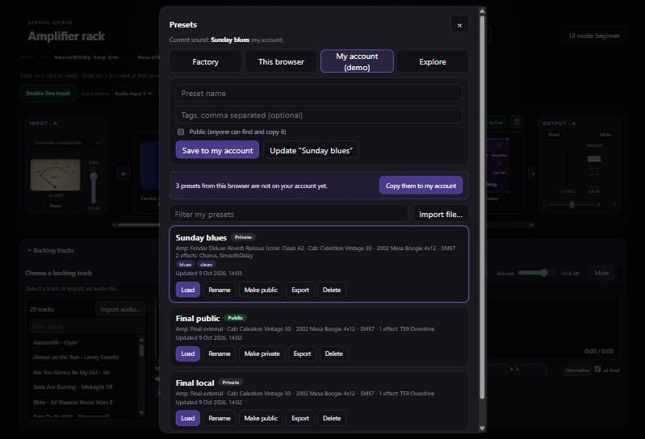 |
| 7 sons d'usine en lecture seule, avec description et résumé de la chaîne | Presets en ligne, badge *Private*/*Public*, bandeau de copie des presets du navigateur |

| Onglet Explore | Fenêtre Account |
|---|---|
| 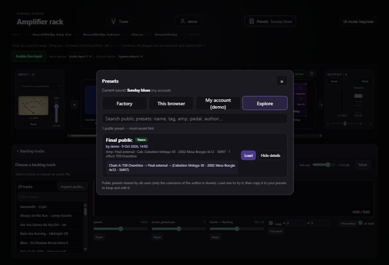 | 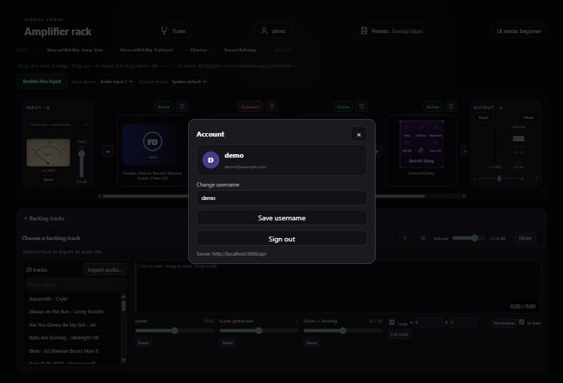 |
| Presets publics : auteur, recherche, ordre du signal (*Details*), *Load* / *Copy to my presets* | Profil (pseudo, email privé), changement de pseudo, déconnexion |

La fenêtre **Presets** a quatre onglets : **Factory** (usine), **This browser** (navigateur),
**My account** (compte, une fois connecté) et **Explore** (presets publics). Les actions irréversibles
(supprimer) ou visibles par tous (rendre public) demandent une confirmation.

### 3.1 Interface et internationalisation (mission 8)

L'hôte a été **entièrement rhabillé** et **traduit**, sans retirer aucune fonction. Le thème
**« Tolex & Lampes »** a été choisi par l'étudiant parmi trois ambiances proposées dans une
maquette (`docs/maquette/`). Il reprend le vocabulaire visuel d'un ampli de guitare : tolex noir,
liseré crème, plaques en métal brossé, voyant orange de lampe.

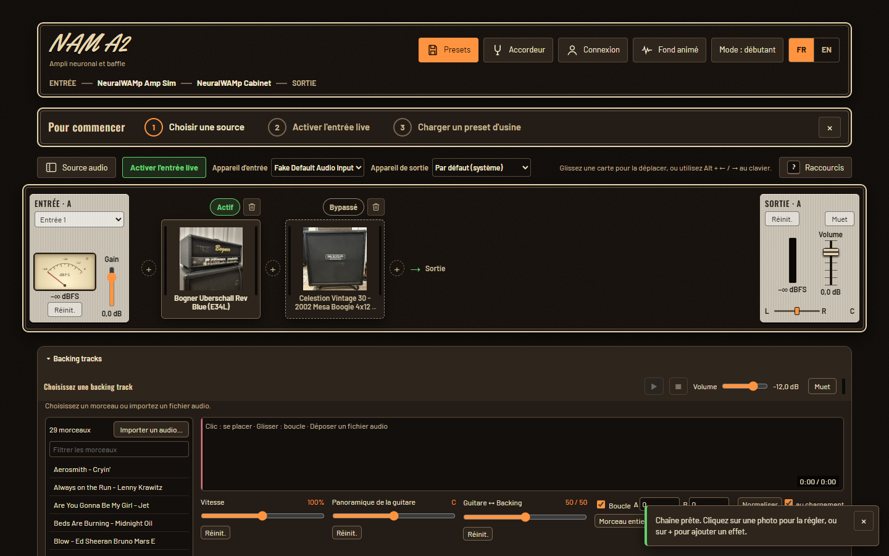

*Le rack en français : en-tête (logo, carte de la chaîne, Presets, Accordeur, Compte, Fond animé,
mode, langue), guide « Pour commencer », bandes Entrée / Sortie et cartes d'effets, lecteur de
backing tracks.*

| Fenêtre Presets (FR) | Fenêtre Compte (FR) |
|---|---|
| 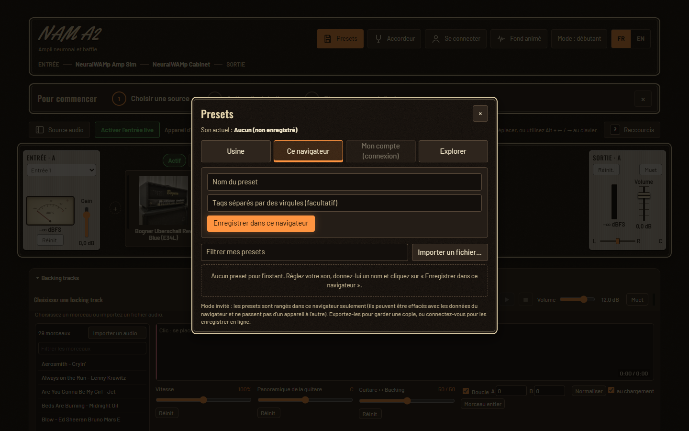 | 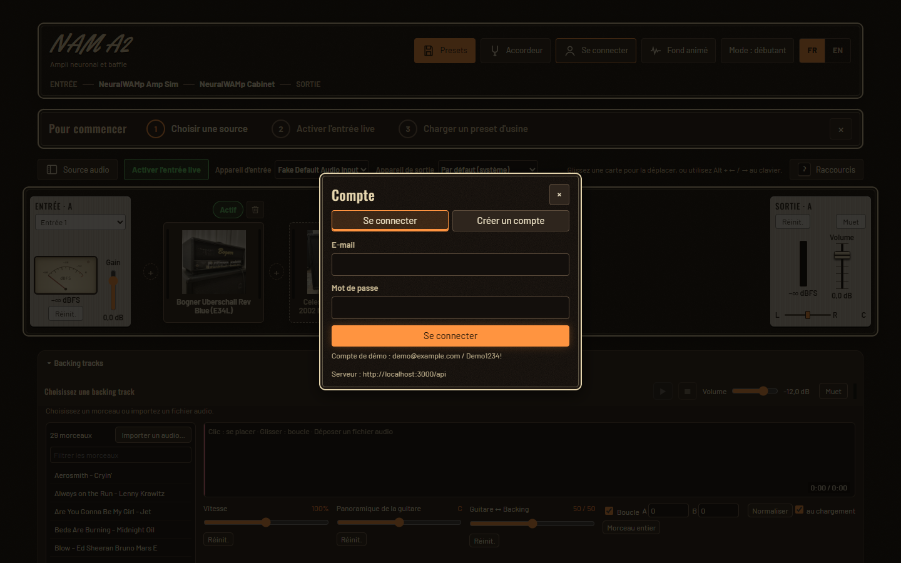 |
| Onglets Usine / Ce navigateur / Mon compte / Explorer, message d'aide quand la liste est vide | Onglets au clavier (flèches), formulaire de connexion ou de création de compte |

| Mode complet, chaînes A et B (EN) | Téléphone, 375 px (FR / EN) |
|---|---|
| 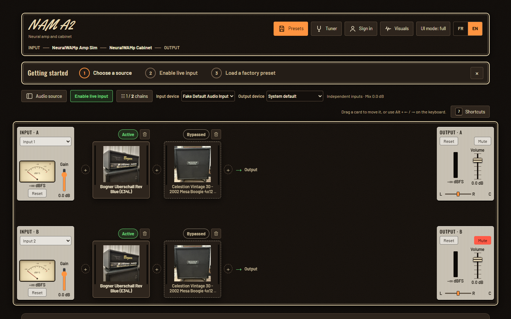 | 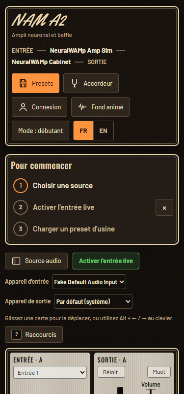 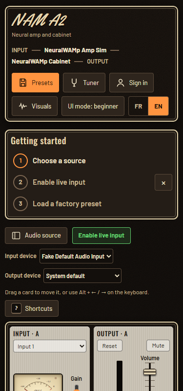 |
| Même écran en anglais, deux chaînes | La mise en page s'empile, sans défilement horizontal |

**Ce qui a changé pour l'utilisateur**
- **Français / anglais** : bouton FR | EN dans l'en-tête. La langue choisie est mémorisée ; au
  premier lancement, c'est celle du navigateur. On peut aussi la forcer avec `?lang=fr` ou
  `?lang=en`. **Changer de langue retraduit tout en direct**, y compris les fenêtres ouvertes, les
  statuts, les messages d'erreur du serveur et les nombres (« −12,0 dB » / « -12.0 dB »), sans
  recharger la page ni effacer ce qui est tapé.
- **Nouvelle mise en page** : en-tête en trois zones avec une carte de la chaîne (ENTRÉE → ampli →
  baffle → SORTIE), panneau « Source audio » repliable, mode débutant (chaîne A seule) ou complet.
- **Guide « Pour commencer »** en 3 étapes (choisir une source, activer l'entrée live, charger un
  preset d'usine), que l'on peut masquer et revoir depuis l'aide.
- **Notifications** (toasts) à la place des messages perdus dans la page ; **fenêtres de
  confirmation** dans le thème à la place des `confirm()` du navigateur.
- **Aide des raccourcis** (touche « ? ») ; déplacement des cartes au clavier (Alt + ← / →).
- **Fond animé** optionnel (visualiseur Butterchurn, façon Milkdrop) qui réagit au son. Il est
  désactivé par défaut, coupé si le système demande moins d'animations, et chargé seulement au clic.
- **Les plugins gardent leur apparence d'origine** : le thème habille seulement le cadre des cartes,
  jamais les vignettes ni les interfaces des plugins (exigence de l'étudiant).

**Comment c'est fait**

| Élément | Fonctionnement |
|---|---|
| Thème | Variables CSS (« design tokens ») dans `ui/theme.css` ; polices hébergées dans le projet (Oswald, Barlow, Yellowtail), aucune requête externe |
| Dictionnaires | `ui/locales/fr.js` et `en.js` : mêmes clés, mêmes paramètres (vérifié par un test), pluriels `{one, other}` |
| Traduction du HTML | attributs `data-i18n`, `data-i18n-title`, `data-i18n-aria-label`, `data-i18n-placeholder`, `data-i18n-params` (JSON), appliqués par `applyTranslations()` |
| Traduction du JavaScript | `t(clé, paramètres)` ; `localize(élément, {text, title, ariaLabel}, paramètres)` traduit un élément **et** le marque pour qu'il suive la langue ; chaque vue s'abonne à `onLanguageChange` |
| Code du professeur non modifié | les messages anglais du moteur (FxChain, SourceManager…) sont traduits **à l'affichage** (`ui/hostMessages.js`) ; les textes exigés par ses tests restent en anglais dans `index.html` et sont traduits au chargement |
| Erreurs | le serveur renvoie un **code** stable (`code`, `params`, `detailCode`) en plus du message anglais ; l'hôte affiche la traduction de ce code |
| Accessibilité | audit **axe-core** (WCAG 2.1 AA) en FR et EN dans tous les états : **0 violation côté hôte** ; tabulation dans un ordre logique et focus visible ; `<html lang>` mis à jour ; zones repères nommées ; statut lu par les lecteurs d'écran retraduit |

## 4. Choix techniques

| Sujet | Choix | Pourquoi |
|---|---|---|
| Interface | JavaScript vanilla (modules ES), fenêtres `<dialog>` | L'hôte d'origine est en vanilla : pas de réécriture, pas de second build |
| Format de preset | `{format: 'nam-a2-preset', version: 1, id, name, description, tags, summary, rack}`, versionné, avec migration | Défini **une seule fois** (`PresetFormat.js`), utilisé par le navigateur **et** le serveur |
| Modèles / IR | Remplacés par des **références** : identifiant d'usine (manifestes livrés) ou empreinte SHA-256 (asset externe) | Un preset brut pèse ~850 Ko (modèle .nam + IR) ; avec références ~14 Ko ; pas de doublons |
| Stockage | « Adaptateurs » aux mêmes méthodes : IndexedDB (navigateur), API (compte), catalogue public, catalogue d'usine ; la lecture seule est une **capacité** du stockage | Ajouter le mode en ligne n'a presque pas touché à la logique d'enregistrement/chargement |
| Indicateur « modifié » | **Empreinte** du son (état JSON sans les gros contenus) comparée après chaque interaction | Les éditeurs des plugins changent leurs réglages sans émettre d'événement |
| Backend | Express 5 + Mongoose + MongoDB Atlas, repris du TP1-3 et adapté | Pile déjà maîtrisée ; `createApp()` séparé de `server.js` pour les tests |
| Authentification | JWT HS256 (12 h), mots de passe bcrypt | Sans état côté serveur ; standard |
| Assets partagés entre utilisateurs | **Preuve de possession** : envoyer le contenu (hash vérifié) ajoute l'utilisateur aux propriétaires, sans doublon | Deux guitaristes ayant la même capture la partagent, mais connaître le hash d'un modèle privé ne suffit pas |
| Presets d'usine | Générés **avec les vrais plugins** par un script versionné (`tools/factory-presets/`) à partir de « recettes » | Ils sont l'état réel des plugins, portables (aucune URL propre à une machine) |
| Traduction | Module maison `ui/i18n.js` (~200 lignes), sans bibliothèque | Deux langues, pas de build : une bibliothèque i18n aurait ajouté une dépendance pour peu de gain ; retraduction en direct par abonnement |
| Thème | Variables CSS + une seule feuille de thème ; maquette HTML comparée avant de coder | Le choix visuel a été fait par l'étudiant sur pièce ; les plugins ne sont jamais touchés |
| Spec d'origine | Conformité à `SPECIFICATION_FX_CHAIN.md` §7.2 (« Factory and user presets ») | Le professeur y décrivait déjà cette phase (IndexedDB + adaptateur, assets partagés, presets d'usine en lecture seule) |

## 5. Sécurité

55 mesures, chacune avec son emplacement dans le code, sa raison et le test qui la vérifie, sont
détaillées dans [`SECURITE.md`](SECURITE.md). Les principales :
- mots de passe hachés (bcrypt, limités à 72 octets car bcrypt ignore la suite) ;
- JWT signé HS256, secret uniquement dans `server/.env` (le serveur refuse de démarrer sans) ;
- limite de tentatives : 10 connexions / 15 min et 5 inscriptions / heure par IP (`429`) ;
- un preset privé d'un autre utilisateur répond `404` (son existence n'est pas révélée) ;
- modèles/IR : hash recalculé par le serveur, accès réservé, preuve de possession ;
- validation de toutes les données reçues avec les mêmes règles que le navigateur, recherche échappée ;
- aucun HTML venant d'un utilisateur n'est interprété (pas de XSS) ;
- CORS limité, tailles de requêtes bornées, quota de 200 Mo par utilisateur, email jamais exposé ;
- interface (mission 8) : traductions toujours insérées comme du texte (jamais `innerHTML`), langue
  de l'URL ou du stockage acceptée seulement si elle est dans la liste `fr` / `en`, codes d'erreur du
  serveur sans détail interne, code tiers (Butterchurn) hébergé dans le projet avec empreintes vérifiées.

## 6. Architecture

```
Navigateur — hôte WAM (examples/wam)                    Serveur (server/, Node + Express)        MongoDB Atlas
  main.js ── FxRack.getState() / setState()
  presets/  PresetManager ─┬─ FactoryPresetStorage (usine, lecture seule)
                           ├─ IndexedDbPresetStorage (navigateur)
                           ├─ RemotePresetStorage ─── HTTP + JWT ──► /api/presets  (privés / publics) ─► presets
                           └─ RemotePresetStorage (public, lecture seule) ──► /api/presets/public
            PresetAssets : modèles/IR ⇄ références (hash)  ──────────► /api/assets/:hash (SHA-256) ─► assets
  account/  ApiClient + AccountView  ─────────────────────────────────► /api/auth, /api/users/me ─► users
```

| Dossier | Contenu |
|---|---|
| `examples/wam/presets/` | Format, assets par hash, stockages, gestionnaire, fenêtres Presets/Explore, presets d'usine |
| `examples/wam/account/` | Client de l'API, fenêtre Account, règles des comptes (partagées avec le serveur) |
| `server/` | API Express : `models/` (User, Preset, Asset), `routes/` (auth, presets, assets), `test/` |
| `tools/factory-presets/` | Générateur des presets d'usine |
| `examples/wam/ui/` | Interface commune (mission 8) : thème, polices, traduction (`i18n.js`, `locales/`, `hostMessages.js`), sélecteur de langue, notifications, confirmations, onglets, guide, aide des raccourcis, fond animé (`vendor/butterchurn/`) |
| `docs/maquette/` | Maquette HTML des trois ambiances proposées |
| `tests/phase5/` | Tests de l'hôte ajoutés par le projet (presets, comptes) |
| `tests/phase6/` | Tests de l'interface (thème, traduction, mise en page, accessibilité, fond animé) |

## 7. Découpage du travail

Chaque mission a été faite sur sa propre branche (`feature/...`), testée, relue, puis fusionnée dans
`develop`. Le détail (fichiers, explications, problèmes rencontrés, comment tester) est dans
[`SUIVI.md`](SUIVI.md).

| # | Mission | Contenu |
|---|---|---|
| — | Installation | Chaîne de compilation C++ → WebAssembly (WSL, emsdk, CMake, Ninja), `npm run dist`, fork |
| 0 | Organisation | Règles du projet (`CLAUDE.md`), suivi, rapport, workflow Git |
| 1 | Presets locaux | Format, assets par hash, IndexedDB, export/import, fenêtre Presets |
| 2 | Backend | API comptes + presets + assets, tests avec MongoDB en mémoire |
| 3 | Comptes dans l'hôte | Client API, fenêtre Account |
| 4 | Presets en ligne | Stockage « compte », privé/public, copie des presets locaux |
| S | Revue de sécurité | Anti force brute, compte démo hors production, limite bcrypt, JWT HS256 |
| 5 | Explorer | Presets publics : recherche, aperçu, chargement, copie |
| 6 | Presets d'usine | 7 sons générés avec les vrais plugins, `SECURITE.md` |
| 7 | Finitions | Nettoyage du code (`/simplify`), ce rapport |
| 8 | Refonte de l'interface | Maquette, thème « Tolex & Lampes », traduction FR/EN, nouvelle mise en page, guide, notifications, fond animé, audit d'accessibilité |

## 8. Tests

| Suite | Commande | Résultat |
|---|---|---|
| Hôte — tests d'origine du projet | `npm test` (racine) | **146 / 146** ✅ (toujours verts) |
| Hôte — tests ajoutés (`tests/phase5/`, 10 fichiers) : presets, comptes | `npm test` (racine) | **77 / 77** ✅ |
| Hôte — tests ajoutés (`tests/phase6/`, 8 fichiers) : interface, traduction, accessibilité | `npm test` (racine) | **63 / 63** ✅ — total **286 / 286** |
| Backend (`server/test/`, MongoDB en mémoire) | `cd server && npm test` | **43 / 43** ✅ |

La refonte (mission 8) n'a **modifié aucun test existant** : les tests du professeur et ceux des
missions 1 à 7 passent tels quels. C'est pour cela que certains textes exigés par ces tests restent
écrits en anglais dans `index.html` et sont traduits au chargement.

Ce qui est testé :
- **Unitaires** : format, validation et migration des presets ; déshydratation/réhydratation des
  modèles et IR ; IndexedDB simulée (`fake-indexeddb`) ; export/import ; client API avec un faux
  serveur ; règles des comptes ; catalogue d'usine (chaque référence pointe vers un vrai fichier livré,
  même hash ; chaque pédale existe dans le catalogue).
- **Backend** : comptes, droits (presets et assets d'un autre), validation, recherche, pagination,
  copie, preuve de possession, ménage des assets orphelins, migration, CORS, sécurité (force brute,
  mot de passe trop long, algorithme du jeton).
- **De bout en bout** (6 tests) : le **vrai code du navigateur** (`ApiClient`, `RemotePresetStorage`,
  `PresetManager`) contre le **vrai serveur** — un de ces tests a découvert un vrai bug de conception
  (deux utilisateurs avec la même capture), corrigé par la preuve de possession.
- **Dans le navigateur, avec les vrais plugins** (à chaque mission) : enregistrement puis
  rechargement **à l'état strictement identique**, presets d'usine (chaîne, réglages et volume
  mesurés avec un signal test), comptes, Explore, affichage mobile, serveur coupé ; pour la
  mission 8 : parcours complet en français puis en anglais à 1440 px et 375 px, clavier seul,
  audit axe-core dans chaque état de l'interface.

Relectures : `/code-review` aux missions 2 à 6 (35 points relevés, tous traités, 34 corrigés et 1 compromis documenté), revue de
sécurité, puis `/simplify` (règles dupliquées regroupées, code mort supprimé, lecture seule devenue
une capacité du stockage, chargements en parallèle et mis en cache). Mission 8 : `/code-review` et
`/simplify` à chaque étape, relecture des textes FR/EN, puis une chasse aux bugs finale qui en a
trouvé trois (libellé d'une carte qui ne correspondait pas au nom affiché, statut lu par les
lecteurs d'écran non retraduit, touche « ? » interceptée dans un champ du lecteur de backing tracks).

## 9. Utilisation de l'assistant IA

Le projet a été réalisé avec **Claude Code** (Claude), utilisé comme binôme de développement. Le
fichier [`SUIVI.md`](SUIVI.md) trace chaque étape et chaque décision.

**Ce que l'IA a fait**
- **Analyse** du projet du professeur (README, spec `SPECIFICATION_FX_CHAIN.md`, code de l'hôte) et
  découverte que la spec décrivait déjà la phase « presets » (§7.2), sur laquelle le plan s'est aligné.
- **Installation** de la chaîne de compilation (WSL Ubuntu, emsdk, CMake, Ninja, sans droits admin) et
  mise en route de `npm run dist` ; script `build.bat` pour Windows.
- **Conception** proposée puis discutée : fonctionnalités, interface, choix techniques, découpage en
  missions (plan validé avant de coder, comme le demande le sujet).
- **Code et tests** de chaque mission, **vérification dans un vrai navigateur** avec les vrais plugins,
  **relectures** automatisées (`/code-review`, revue de sécurité, `/simplify`) et corrections.
- **Documentation** : `SUIVI.md` (explications pédagogiques, schémas de flux), `SECURITE.md`,
  `API_CONTRACT.md`, messages de commit détaillés.

**Ce que l'étudiant a décidé** (questions posées par l'IA à chaque choix structurant)
- le sujet (ampli virtuel + pédales, à partir du projet du professeur) et le périmètre (comptes,
  presets privés/publics, recherche, presets d'usine, sans système d'amis) ;
- interface en JavaScript vanilla (en anglais au départ, puis en français et en anglais à la
  mission 8) ; reprise du backend du TP ; base Atlas ;
- pseudo public + email privé ; contenu d'un preset (rack A+B, sans gain d'entrée ni backing track) ;
- presets copiés (et non déplacés) vers le compte ; enregistrement sur le compte par défaut ;
- messages de l'API en anglais ; revue de sécurité avancée avant d'ouvrir les presets publics ;
- organisation Git (une branche par mission, intégration dans `develop`) ; tests exigés à chaque étape ;
- mission 8 : le thème « Tolex & Lampes » parmi trois maquettes, un seul thème (pas de sélecteur),
  l'ajout du fond animé Butterchurn en option, et la règle « les plugins gardent leur apparence
  d'origine ».

**Limites de l'IA constatées** : elle ne peut pas écouter le son (les volumes des presets d'usine ont
été **mesurés**, pas écoutés), ni utiliser un micro dans son navigateur de test ; certaines erreurs
ont été introduites puis attrapées par les tests et relectures (octet nul invisible dans un fichier,
oubli d'une option Mongoose qui aurait empêché le serveur de démarrer) — d'où l'importance des tests
systématiques.

## 10. Limites et perspectives

**Limites**
- Le jeton de session est stocké dans le `localStorage` (compromis documenté dans `SECURITE.md`).
- Le limiteur de tentatives est en mémoire (un seul serveur) ; un déploiement réel demande **HTTPS**.
- Pas encore de vérification d'email, de réinitialisation de mot de passe ni de suppression de compte.
- Les volumes des presets d'usine sont égalisés avec un signal test, pas avec une vraie guitare.
- L'adresse de l'API est fixée dans `config.js` (`http://localhost:3000/api`).
- Accessibilité : les interfaces des plugins (code du professeur, non modifiable) gardent quelques
  contrastes trop faibles (éditeur NAM, accordeur) relevés par axe-core ; l'audit a été automatique
  et au clavier, pas avec un vrai lecteur d'écran.
- Les noms des sons, des plugins et des tags, ainsi que la page de test des effets (`fx-test/`),
  restent en anglais.

**Perspectives**
- Amis et partage privé entre amis (piste du diapo), « likes » et presets favoris.
- Aperçu audio d'un preset (rendu hors ligne d'un court riff) avant de le charger.
- Déploiement en ligne (dist sur mainline, API sur un hébergeur, HTTPS, cookie `HttpOnly`).
- Inclure optionnellement la backing track dans un preset (« mon son pour jouer sur tel morceau »).

## 11. Lancer le projet

```bash
# 1. Backend (terminal 1) — nécessite server/.env (voir server/.env.example)
cd server && npm install && npm start            # http://localhost:3000/api/health

# 2. Hôte : compiler la distribution (WSL) puis ouvrir dist/NAM_A2_WAM/index.html avec Live Server
npm run dist                                     # (ou build.bat sous Windows)

# 3. Tests
npm test                                         # hôte : 286 tests
cd server && npm test                            # backend : 43 tests
```

Compte de démonstration (créé automatiquement en développement) : `demo@example.com` / `Demo1234!`.
